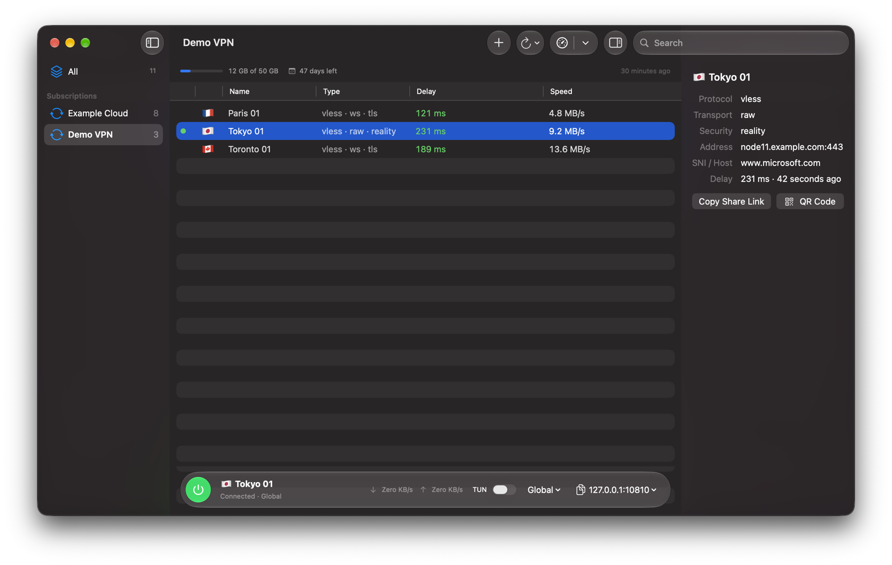
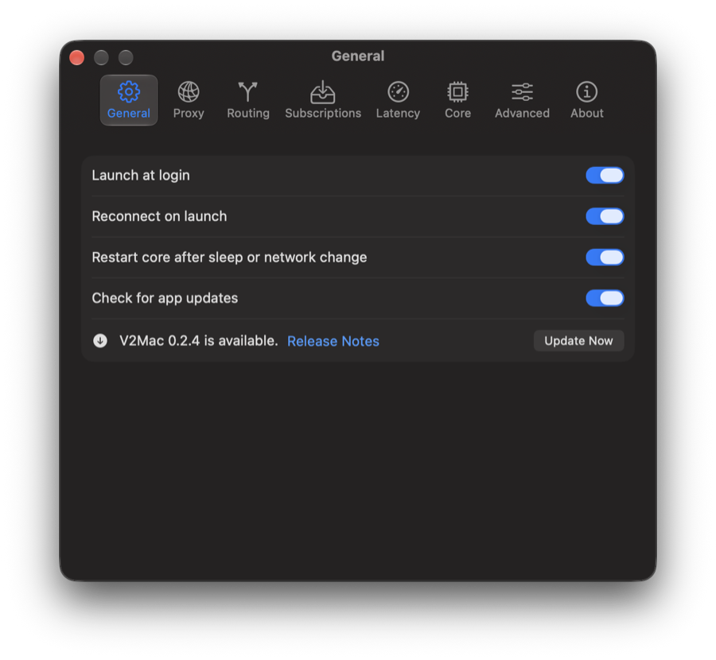

<p align="center"></p>

<p align="center">English | <a href="README.fa.md">فارسی</a></p>

# V2Mac

**A native macOS client for [Xray-core](https://github.com/XTLS/Xray-core).** Paste a subscription link, pick a server, and get a local SOCKS5 + HTTP proxy. Built with SwiftUI and Liquid Glass, for Apple Silicon.

## Features

- **Subscriptions:** import VLESS, VMess, Trojan, Shadowsocks, Hysteria2, WireGuard and plain SOCKS/HTTP links, or full Xray JSON configs. Auto-update, and shows your traffic usage and expiry date when the provider sends them.
- **Favorites:** star the servers you like and find them in one list. A subscription update never removes them without asking.
- **Latency tests:** real-delay and TCP ping for a whole group at once, sorted by speed.
- **Routing:** Global, Direct, or Bypass regions (Iran included) to send local traffic direct.
- **TUN mode:** one switch routes all traffic on the Mac through the proxy, including apps with no proxy setting. No paid developer account or system extension needed.
- **Menu bar control:** connect, switch server, live speed, and a local address you can copy.
- **Reliable:** restarts the core after a crash, sleep or network change, and reconnects on launch.
- **Also:** LAN sharing with a password, QR codes, a log viewer, launch at login, and one-click updates for the app and the Xray core.
- **Private:** no analytics or telemetry.

## Screenshots

Shown with made-up demo servers.

<p align="center"></p>

The main window lists each subscription with its traffic usage and days left, plus every server's delay and top download speed. Select a server to see its details and copy its share link or QR code. The bar at the bottom shows the connection, the TUN switch, the routing mode and the local proxy address.

<p align="center"></p>

Settings cover launch at login, reconnecting, restarting the core after sleep or a network change, and one-click app updates. More tabs hold the proxy, routing, subscriptions, latency, core and advanced options.

## Install

Requires macOS 26 or later on Apple Silicon.

1. Download `V2Mac-<version>.dmg` from [Releases](../../releases) and drag **V2Mac** to **Applications**.
2. The app is not notarized, so macOS blocks the first launch. Open it once, then go to **System Settings → Privacy & Security** and click **Open Anyway**. Or run:
   ```sh
   xattr -dr com.apple.quarantine /Applications/V2Mac.app
   ```
3. Click **Add Subscription**, paste your link, and double-click a server to connect.
4. Point your apps at `socks5://127.0.0.1:10808` or `http://127.0.0.1:10808`.

To proxy the whole Mac instead, turn on the **TUN** switch next to the routing menu. macOS asks for an administrator password once each time V2Mac is opened; nothing is installed.

Closing the window keeps the proxy running. Quit with ⌘Q to stop it.

## Leak protection in Chrome: noleaker

A proxy alone does not stop the browser from giving you away: WebRTC can expose your real IP, DNS and QUIC can go around the proxy, and your timezone and language still say where you are. For Chrome and other Chromium-based browsers, use [**noleaker**](https://github.com/LordVersA/noleaker), a free, open-source extension from the same author that pairs with V2Mac:

- Sends all browser traffic and DNS lookups through V2Mac's SOCKS5 proxy, and blocks WebRTC and QUIC leaks.
- Matches timezone, language and geolocation to the country of your server.
- Kill switch: if the proxy goes down, requests are blocked instead of going out directly.
- Built-in leak test that checks each of these and says which setting fixes a failure.
- Compatibility mode lets Iran-hosted sites skip the proxy.

Setup: install noleaker from its [latest release](https://github.com/LordVersA/noleaker/releases/latest), add a proxy with host `127.0.0.1` and port `10808`, and switch **Protection** on. noleaker cannot send a proxy username or password, so leave those empty in V2Mac's settings. It is tested on Chrome 120 and newer.

## Build from source

```sh
Scripts/fetch-core.sh
xcodegen generate
xcodebuild -project v2mac.xcodeproj -scheme v2mac -configuration Debug build
```

Needs Xcode 26+ and [XcodeGen](https://github.com/yonaskolb/XcodeGen). The design is in [docs/SPEC.md](docs/SPEC.md).

## License

GPL-3.0. See [LICENSE](LICENSE) and [THIRD_PARTY.md](THIRD_PARTY.md).
